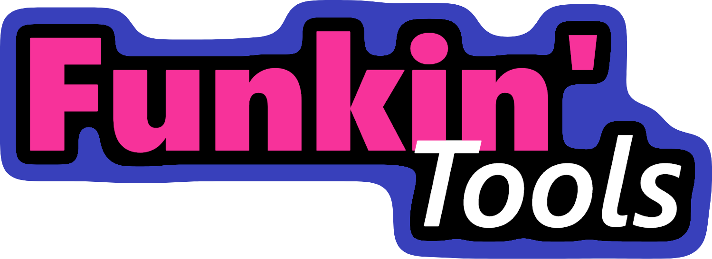

    
    <h6> Actually, its development time has been as long as FNF v0.3 up to now, but I have rewritten it three times. Now it is the fourth time </h6>

- [简体中文](README_CN.md)

# Funkin Tools
***The project involves AI writing code***
This project is a tool used to convert data from various engines in **Friday Night Funkin** to other engines.

The engines currently under planning and production include
- [Codename Engine](https://github.com/CodenameCrew/CodenameEngine/)
- [Psych Engine 0. X and 1.0 x](https://github.com/ShadowMario/FNF-PsychEngine)
- [V-Slice](https://github.com/funkincrew/funkin/)

The content of the conversion includes but is not limited to
- Chart
- Character
- Stage

Project progress
Up to now, I haven't written anything...
- [ ] Basic interface
- [ ] Web adaptation
- [X] Codename Chart -> Psych Chart
